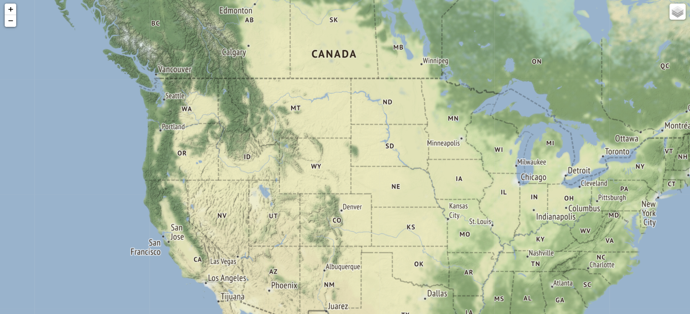

# Web Map

 

## Application ScreenShoot
 

 
 

## What we have in this Map?

- By Default we have a page in which we have marked different Volcanoes Location present in the American Region.
- Black marks means the volcanos is present in Washington.
- Orange marks means the volcanos is present in Mexico.
- Red makrs means volcanos present in location others then these two.

 

## Functionality of Map:-
- If you Click on the particular mark you'll get the exact location of the Volcano as well as the name of the volcano.
- If you click on the Layer at top Right corner(fig 0.1) you can turn the map back to simple one(fig 0.2).
- Also you can Zoom in and out by using + and - sign in top left corner
 
 
  
FIG 0.1
 
 

-    FIG 0.2
  
  

## Data Source:-
This Map data is extracted from world.json file and the list of volcanoes is extracted from volcanoes.txt file

